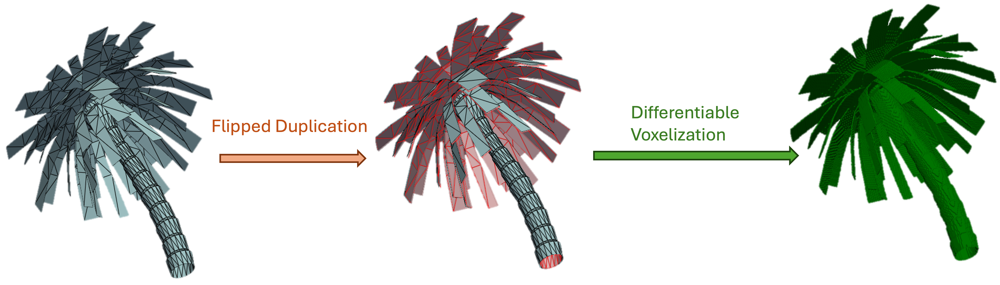

# DOPH: Differentiable Occupancy and Mesh Morphing
Differentiable Tool for Mesh2Occupancy &amp; Mesh2SDF 


This repository contains the code for the paper "[Differentiable Voxelization and Mesh Morphing](https://arxiv.org/abs/2407.11272)"  by [Yihao Luo](https://github.com/Luo-Yihao) et al. DOPH is a differentiable tool for mesh to occupancy and mesh to SDF conversion. Unlike previous tools implemented on the CPU used in [Mesh2SDF](https://pypi.org/project/mesh2sdf/) and [DOGN](https://github.com/microsoft/DualOctreeGNN) , DOPH is a differentiable tool that can be used to convert mesh to occupancy and SDF in a differentiable way, which can be directly integrated into the deep learning framework. Meanwhile, with **GPU acceleration**, DOPH can extract occupancy and SDF in **arbitrary resolution** in real-time, even for **non-watertight (even for completely open meshes)**，**non-manifold**, **self-intersecting** and **combined** meshes.

## Installation

The core code of DOPH only depends on  and . One can try to install the dependencies by running the following command (be careful with the version of PyTorch and PyTorch3D):
```setup
## Torch
pip install torch==2.1.1 torchvision==0.16.1 torchaudio==2.1.1 --index-url https://download.pytorch.org/whl/cu118

## PyTorch3d
conda install -c iopath iopath
conda install -c fvcore -c conda-forge fvcore
pip install --no-index --no-cache-dir pytorch3d -f https://dl.fbaipublicfiles.com/pytorch3d/packaging/wheels/py39_cu118_pyt201/download.html

## Pyg
pip install pyg_lib torch_scatter torch_sparse torch_cluster torch_spline_conv -f https://data.pyg.org/whl/torch-2.1.1+cu118.html
pip install torch_geometric

## Other dependencies
pip install -r requirements.txt
```
## Usage
Run the following command to convert a mesh to occupancy and SDF (No gradient but with GPU acceleration):
```shell
python mesh2sdf.py --mesh data_example/Bull.obj --mode occpancy --resolution 256 
```
The occupancy and SDF will be saved in the `output` folder, containing the following files:
```shell
output
├── Bull
│   ├── Bull_ori.obj
│   ├── Bull_occp_256.npy
│   ├── Bull_sdf_128.npy
│   └── Bull_occp_256.obj
...
```
where `Bull_ori.obj` is the original mesh, `Bull_occp_256.npy` is the occupancy in resolution 256, `Bull_sdf_128.npy` is the SDF in resolution 128, and `Bull_occp_256.obj` is the re-cubified mesh from the corresponding occupancy field. **The re-cubified mesh can be used as the watertight mesh for further processing**.

More generally, for a given mesh and query points, one can use the following code to get the occupancy and SDF:
```python
import torch
from ops.mesh_geometry import occupancy, signed_distance_field, normalize_mesh
from pytorch3d.io import load_objs_as_meshes

# Load a mesh
mesh = load_objs_as_meshes("data_example/Bull.obj")
# normalize the mesh
mesh = normalize_mesh(mesh)

# Query the occupancy
q = torch.rand(100, 3)*2.-1.
q.requires_grad = True

# Get the occupancy 
occp = occupancy(mesh, q)
print(occp)
# Get the SDF with gradient
sdf = signed_distance_field(mesh, q, allow_grad=True)
print(sdf)
print(sdf.grad)

# For SDF extraction for a complex and unconstrained mesh, 
with torch.no_grad():
    sdf_ng = get_sdf_from_mesh(mesh, q)
    occp_ng = get_occp_from_mesh(mesh, q)
print(sdf_ng)


```
The `occupancy` function is adaptive to non-watertight (almost-closed) meshes. For completely open meshes, we provide the **flipped duplication** method to convert the open mesh to a almost-closed mesh. 



The differentiable voxelization and mesh morphing can be used for mesh reconstruction, which is extremely useful for 3D medical image processing. For more details, please refer to our  repository [GHDHeart](https://github.com/Luo-Yihao/GHDHeart), where we use the differentiable slicing to reconstruct the 3D heart from 2D scans. 


## Citation
If you find this code useful for your research, please kindly consider citing the following papers:

```bibtex
@article{lou2024doph,
    title={Differentiable Voxelization and Mesh Morphing},
    author={Yihao Luo, Yikai Wang,Zhengrui Xiang,
    Yuliang Xiu, Guang Yang, ChoonHwai Yap},
    journal={arXiv preprint arXiv:2407.11272},
    year={2024}} 

@misc{luo2024explicitdifferentiableslicingglobal,
      title={Explicit Differentiable Slicing and Global Deformation for Cardiac Mesh Reconstruction}, 
      author={Yihao Luo and Dario Sesia and Fanwen Wang and Yinzhe Wu and Wenhao Ding and Jiahao Huang and Fadong Shi and Anoop Shah and Amit Kaural and Jamil Mayet and Guang Yang and ChoonHwai Yap},
      year={2024},
      eprint={2409.02070},
      archivePrefix={arXiv},
      primaryClass={eess.IV},
      url={https://arxiv.org/abs/2409.02070}, 
}
```